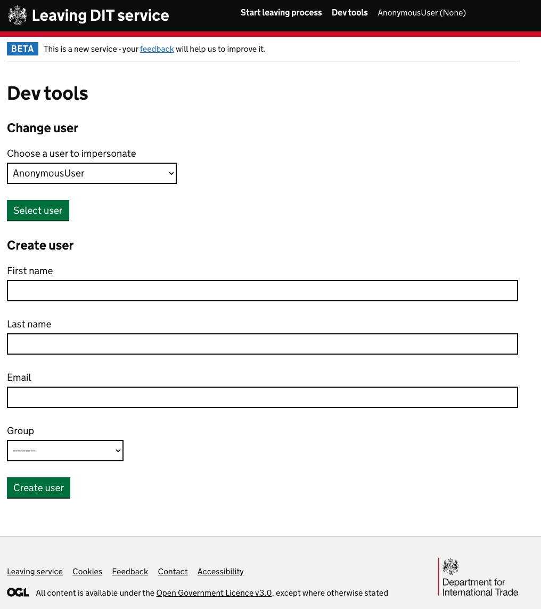

---
hide:
  - navigation
---

# Leaving DIT Service

## Developer notes
Notes that must be read and understood by developers working on the service.

### UK SBS Person ID
The `person_id` field that we get back from UK SBS must NOT be exposed to any end user of the service, it must also not be exposed in any logs on this service.
This field contains sensitive information that is only to be used for the purposes of getting Hierarchy data from the UK SBS API and submitting it back to UK SBS to inform them of a Leaver.

## Getting started

### Dependencies
To get the project running locally, you will need to have [Docker](https://www.docker.com/) installed.

### Running the project
First you will need to make a copy of the `.env.example` file and rename it to `.env`. This file contains all the environment variables that the project needs to run.

```bash
cp .env.example .env
```
There might be some values that you need to configure, talk to SRE for these values.

Next, you will need to copy the example local settings file and rename it to `local.py`. This file contains all the settings that the project needs to run.

```bash
cp config/settings/local.example.py config/settings/local.py
```

Now you can run start running the commands to set up the site.

```bash
npm install
make first-use
```

This will result in the webserver being served on port `8001`.

It should be accessible at:

- [http://localhost:8001/](http://localhost:8001/)
- [http://0.0.0.0:8001/](http://0.0.0.0:8001/)

### Dev tools

The first page you see when you set up the project for the first time should be the [Dev tools](http://localhost:8001/dev-tools/) page. This page contains a drop down form so you can select from a list of premade users. It also contains a form for you to create your own users.



#### Preconfigured users

The following users already exist, and some of them have behaviors that are useful for testing the service.

| Name | Groups | Notes |
| --- | --- | --- |
| John Smith | Hardware Team | |
| Jane Doe | SRE | |
| Miss Marple | HR | |
| Thomas Anderson | Security Team | |
| Charlotte Blackwood | Asset Team | |
| John Watson | Hardware Team | Has a digital.trade.gov.uk email address |
