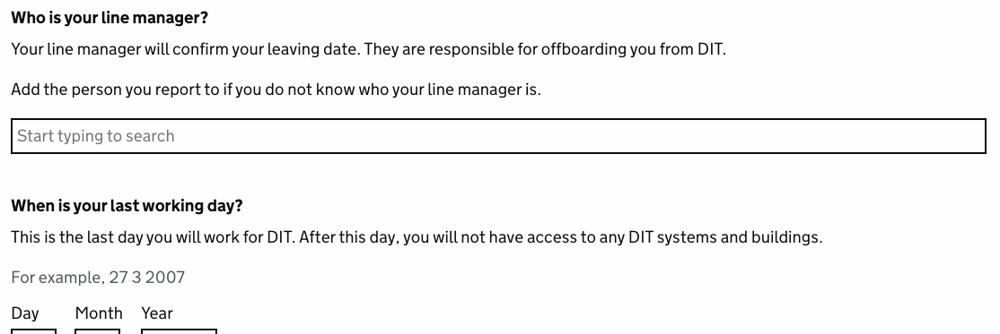

# Staff search

## OpenSearch index

The Staff search uses an OpenSearch index to store the data.

### Staff index mapping schema
``` py title="core/utils/staff_index.py"
--8<-- "core/utils/staff_index.py:25:48"
```

## Staff search component



### Example implementation

#### Add char field to the form
Add a char field to a form to hold the inital staff_uuid value and use the HTMX component to render the form field.

``` py title="leavers/forms/leaver.py"
--8<-- "leavers/forms/leaver.py:30:52"
```

Suppling `search_url` to the `staff_search_autocomplete_field` method, will tell the component which search view to use that will handle storing the data.

Suppling `remove_url` to the `staff_search_autocomplete_field` method, will tell the component which view will handle the logic to clear the data.


#### Create a custom search view
Add a View that inherits StaffSearchView to handle the search.

``` py title="leavers/views/leaver.py"
--8<-- "leavers/views/leaver.py:57:59"
```

The `query_param_name` is the name of the query param that will be used to pass the `staff_uuid` back to the `success_url` to be stored somewhere.
